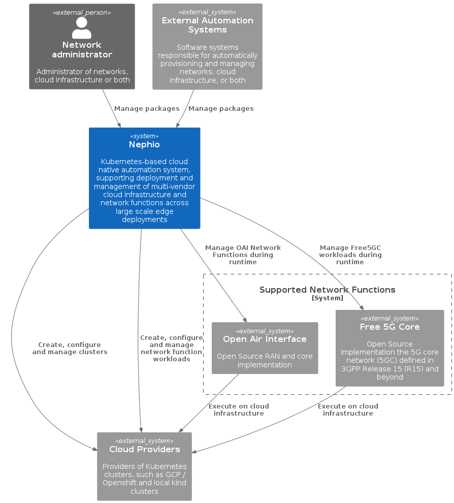
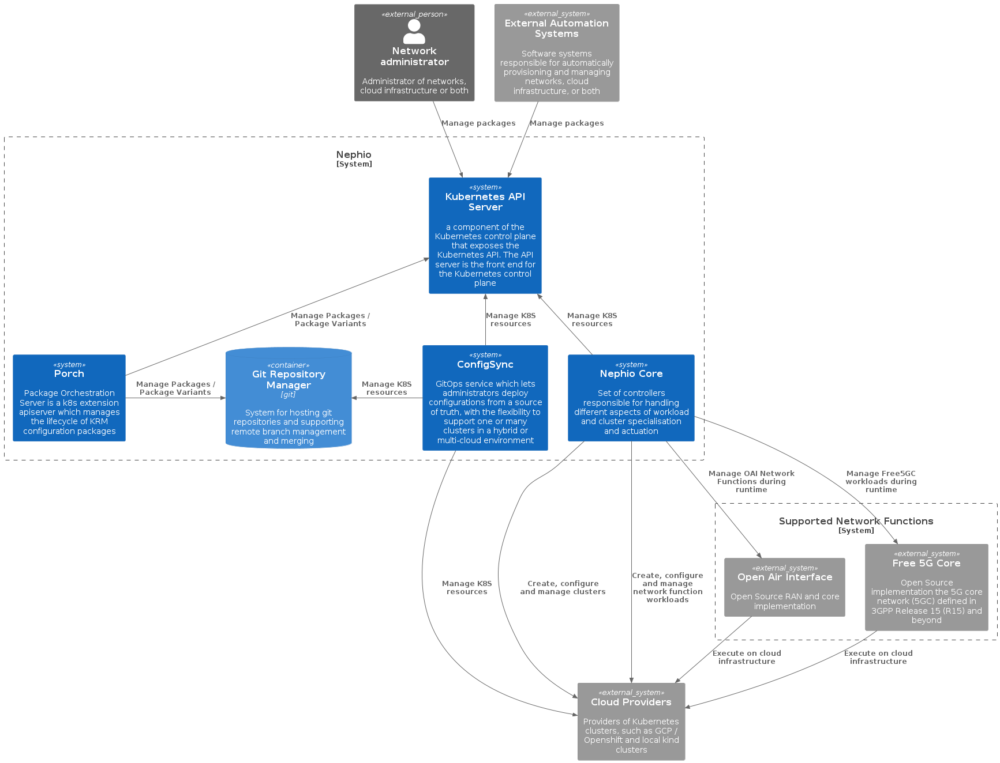
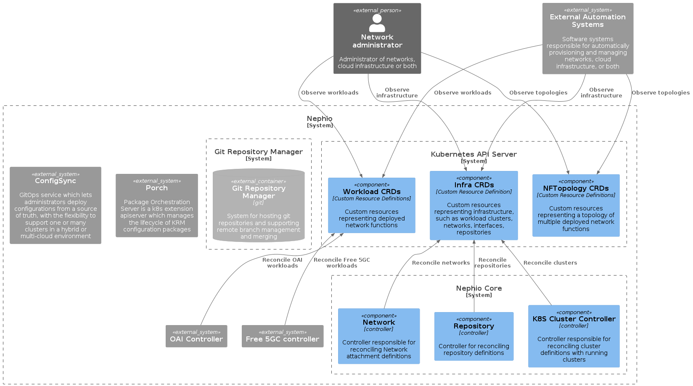

# nephio-arch-docs-playground
Some experiments on working with C4 model to document Nephio

## System Context View

The system context view gives a high level perspective of the Nephio software system and the external entities that it interacts with. There are no deployment considerations in this view - the main purpose of the picture is to depict what is the responsibility and scope of Nephio, and the key interfaces and capabilities it exposes to deliver on that responsibility.

## System Landscape View

Nephio is an amalgamation of software systems, so a system landscape provides a high-level view of how those software systems interoperate.

## Component Views

### Nephio Core

